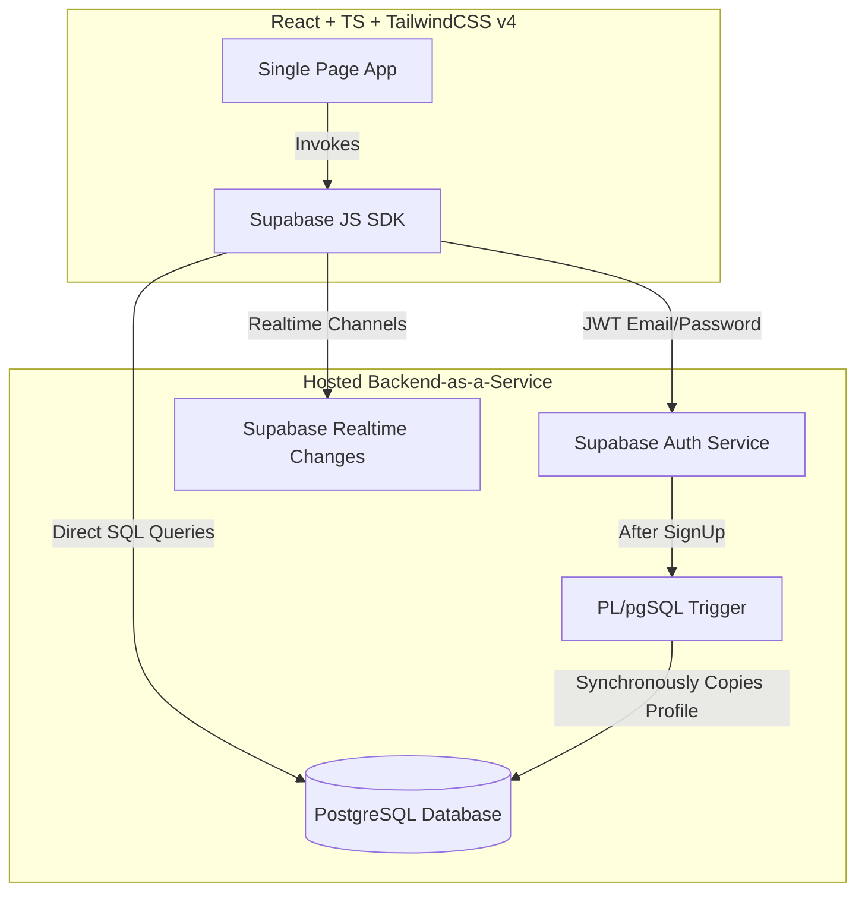

# BUILD_PLAN - SplitSync

SplitSync is a serverless, database-native expense-splitting web application designed to demonstrate robust product architecture, reliable database design, precise financial calculations, and real-time updates using Supabase.

---

## Product Research

SplitSync is designed around the core value proposition of Splitwise: **"A group of people spend money together and need to know who owes whom, while minimizing the actual number of transactions needed to settle up."**

Key workflows identified:
1. **Authentication**: Users register and log in to participate in groups using Supabase Auth.
2. **Groups**: Expenses exist within the context of a group. A group contains multiple members.
3. **Expenses**: When an expense is recorded, one member pays the total amount, and the cost is split among the group members using one of four mathematical split types:
   - **Equal**: Split evenly.
   - **Unequal**: Specific amounts for each member.
   - **Percentage**: Specified percentages (must sum to 100%).
   - **Share**: Proportional share counts.
4. **Real-time Chat**: Group members can discuss a specific expense using Supabase Realtime Channels.
5. **Debt Simplification (Greedy Algorithm)**: Instead of everyone paying each other directly, the system calculates a net balance for everyone and resolves debts through the minimum number of direct transfers.
6. **Settlements**: Debts are cleared when a member records a payment to another member.

---

## Architecture

We employ a serverless / BaaS architecture directly connecting the client application to Supabase:

### 1. Frontend
- **Framework**: React (Vite, TypeScript).
- **Styling**: TailwindCSS v4 (provides modern utility classes, CSS variables, and rapid UI development).
- **Communication**: Supabase Client SDK (`@supabase/supabase-js`) handles user authentication, PostgreSQL queries, and WebSocket Realtime subscriptions.

### 2. Database & Backend Services
- **Engine**: PostgreSQL (hosted on Supabase, featuring ACID transactions and Row Level Security).
- **Authentication**: Managed via Supabase Auth.
- **Real-time**: Handled via Supabase Realtime Channels, listening to `postgres_changes` on the `Message` table.
- **Triggers**: PostgreSQL PL/pgSQL trigger copies new user registrations from `auth.users` to `public.User` profiles synchronously.

---

## DB Tables Structure

- `User`: Public profiles containing name and email.
- `Group`: Expense groups created by users.
- `GroupMember`: Many-to-many relationship linking Users and Groups.
- `GroupInvite`: Pending and accepted email invitations to join groups.
- `Expense`: Expense records (amount, title, description).
- `ExpenseSplit`: Split shares allocated to users for each expense.
- `Settlement`: Recorded peer-to-peer debt payments.
- `Message`: Chat messages written inside expenses.

---

## Scoping & Tradeoffs

To ensure the project is delivered while maintaining production-grade logic and documentation, we have intentionally scoped out several complex workflows.

### Out of Scope Features
- **Email/SMS invitation dispatch**: Invites are created and accepted within the application's dashboard rather than sending external emails (SMTP/Twilio).
- **Push Notifications**: WebSockets handle real-time chat updates while the page is open; push notifications (WebPush/APNS) are excluded.
- **Expense Receipt/Bill Attachments**: S3 receipt upload and OCR processing.
- **Currency Conversion**: All transactions are assumed to be in a single currency (e.g. ₹ / INR).
- **Recurring Expenses**: Auto-generating bills weekly or monthly.
- **Mobile Native Apps**: Responsive mobile web view is provided instead.
- **Multi-language Support (i18n)**: App is English-only.
